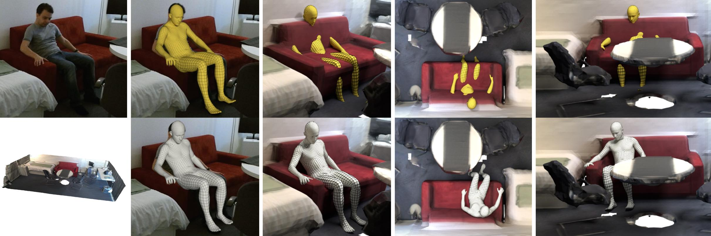

## Resolving 3D Human Pose Ambiguities with 3D Scene Constraints

[[Project Page](https://prox.is.tue.mpg.de/)]
[[Paper](https://ps.is.tuebingen.mpg.de/uploads_file/attachment/attachment/530/ICCV_2019___PROX.pdf)]




## License

Software Copyright License for **non-commercial scientific research purposes**.
Please read carefully the [terms and conditions](./LICENSE) and any accompanying documentation before you download and/or
use the SMPL-X/SMPLify-X/PROX model, data and software, (the "Model & Software"), including 3D meshes, blend weights,
blend shapes, textures, software, scripts, and animations. By downloading and/or using the Model & Software (including
downloading, cloning, installing, and any other use of this github repository), you acknowledge that you have read these
terms and conditions, understand them, and agree to be bound by them. If you do not agree with these terms and conditions,
you must not download and/or use the Model & Software. Any infringement of the terms of this agreement will automatically
terminate your rights under this [License](./LICENSE)

## Description

This repository contains the fitting code used for the experiments in [ Resolving 3D Human Pose Ambiguities with 3D Scene Constraints](https://prox.is.tue.mpg.de).

# PROX Dataset
To run the fitting code, you would need to downlaod and extract at least one of the [PROX datasets](https://prox.is.tue.mpg.de/). The webpage provides the 2 PROX datasets:
- `Quantitative PROX dataset`: Dataset of 180 static RGB-D frames with Ground Truth.
The dataset captures static RGB-D frames of 1 subject in 1 scene and is described in Section 4.2 of the PROX paper.

- `Qualitative PROX dataset`: Dataset of 100K RGB-D frames pseudo Ground Truth.
The dataset captures dynamic RGB-D sequences of 20 subjects in 12 scenes and is described in Section 4.1.2 on the PROX paper.

Both datasets have a very similar structure which is explained next. After extracting the dataset, you should have a directory with the following structure:
```bash
prox_qualitative_dataset
├── body_segments
├── calibration
├── cam2world
├── fittings
├── keypoints
├── keypoints_overlay
├── recordings
├── scenes
└── sdf
```
The content of each folder is explained below:
- `body_segments` contains the contact body parts.
- `calibration` contains the calibration information of the Color and IR cameras of the Kinect-One sensor.
- `cam2world` contains the camera-to-world transformation matrices to spatially align the camera to the 3D scene scans.
- `fittings` contains SMPL-X fittings parameters.
- `keypoints` contains 2D keypoints in json files computed from [openpose](https://github.com/CMU-Perceptual-Computing-Lab/openpose).
- `keypoints_overlay` contains 2D keypoints overlayed on the RGB images as generatd by [openpose](https://github.com/CMU-Perceptual-Computing-Lab/openpose).
- `scenes` 3D scene meshes.
- `sdf` Signed Distance Field of the 3D scenes.
## Recordings Documentation
`recordings` contains the raw RGB-D recordings. The prox dataset come with 60 recordings, each recording folder name has the format of `SceneName_SubjectID_SequenceID`.
Each recording folder includes the following sub_folders:
```bash
SceneName_SubjectID_SequenceID
├── BodyIndex
├── BodyIndexColor
├── Color
├── Depth
└── Skeleton
```
`BodyIndex`: Human masks computed by Kinect-One SDK (png, 512x424 px).
`BodyIndexColor`: Human masks computed by running [DeepLabV3](https://pytorch.org/hub/pytorch_vision_deeplabv3_resnet101/) on the color fames. (png, 1920x1080 px).
`Color`: RGB frames (jpg, 1920x1080 px).
`Depth`: Depth frames (png, 512x424 px, ToF camera).
`Infrared`: Infrared images (png, 512x424 px).
`Skeleton`: Body skeletons captured by Kinect-One SDK (json).

### Visualization
You can visualize the raw data by running the script:
```Shell
python prox/viz/viz_raw_data.py RECORDING_DIR --show_color 1 --show_body_only 1
```
### Color and Depth alignment
The color and depth frame of the kinect are not spatially aligned and they don't have the same resolution. To project one frame to another, you can use the follwing command:
```Shell
python prox/align_RGBD.py RECORDING_DIR --mode MODE
```
where mode can be `depth2color` or `color2depth`.
## Quantitative PROX dataset
The Quantitative PROX dataset has the same structure as explained above in additon to one file `vicon2scene.json`  which contains transformation matrix
 from Vicon coordintates system to the 3D scene coordintates system. The `fitting` folder of the quantitative dataset contains `SMPL-X` fittings computed using
 [[MoSH++](https://amass.is.tue.mpg.de/)]
You can visualize `MoSH` results by running the following command:
```Shell
python prox/viz/viz_mosh.py FITTING_DIR
--base_dir  ~/prox_dataset/quantitative --model_folder ~/prox_dataset/models/ --gender male
```
For example:
```Shell
python prox/viz/viz_mosh.py ~/prox_dataset/quantitative/fittings/mosh/vicon_03301_01/
--base_dir  ~/prox_dataset/quantitative --model_folder ~/prox_dataset/models/ --gender male
```

# Fitting
To run the method you would first need to need to download and extract the [PROX dataset](https://prox.is.tue.mpg.de/) as explained in the previous section. Then run the following command to execute the code:
```Shell
python prox/main.py --config cfg_files/CONF.yaml
    --recording_dir RECORDING_DIR
    --output_folder OUTPUT_FOLDER
    --visualize="True/False"
    --model_folder MODEL_FOLDER
    --vposer_ckpt VPOSER_FOLDER
    --part_segm_fn smplx_parts_segm.pkl
```
where the `RECORDING_DIR` is a path to one of the recordings from the PROX dataset. CONF is the fitting configuration, which code be: RGB, PROX, SMPLifyD or PROXD. For example:
```Shell
python prox/main.py --config cfg_files/PROX.yaml
    --recording_dir ~/prox_dataset/recordings/N3OpenArea_00157_01
    --output_folder ~/PROX_results
    --vposer_ckpt ~/prox_dataset/models/vposer_v1_0/
     --part_segm_fn ~/prox_dataset/models/smplx_parts_segm.pkl
      --model_folder ~/prox_dataset/models
```
This will generate several results: pkl files which include `SMPL-X` parameters, `SMPL-X` body meshes, rendering of the
fitting results overlayed on the color images, rendering of the body in the 3D scene.

You can also visualize the results in 3D by running the following script:
```Shell
prox/viz/viz_fitting.py FITTING_DIR --base_dir BASE_DIR --model_folder ~/prox_dataset/models --gender GENDER
```
where the FITTING_DIR is a directory that contains the `SMPL-X` pkl parameters.
## PROXD Fittings
We provide PROXD fittings for the dataset on the [website](https://prox.is.tue.mpg.de/) as well as preview videos. We provide the fittings as `.pkl` files which contains the `SMPL-X` parameters. For more details on `SMPL-X` parameterization and formulation, check this repository [SMPL-X](https://github.com/vchoutas/smplx).
 Similarly; you can visualize the results in 3D by running the following script:
```Shell
prox/viz/viz_fitting.py FITTING_DIR --base_dir BASE_DIR --model_folder MODEL_FOLDER
```
You can also create meshes from the `.pkl` files and render the results using:
```Shell
prox/renderer.pkl FITTING_DIR --base_dir BASE_DIR --model_folder MODEL_FOLDER
```

## Note
The master branch of this repository depends on the released versions of [SMPLify-X](https://github.com/vchoutas/smplify-x) and [Vposer](https://github.com/nghorbani/human_body_prior) on github.  These versions differ from our internal versions and hence the produced results might differ from what is reported in the paper.
We provide another branch `internal_vposer` which has a reimplemnetation of the internal human_body_prior. If you want to replicated the results reported in Table 1 in the paper; then please checkout this version by:
```Shell
git checkout internal_vposer
```
Then download the vPoser Weights from our [website](https://prox.is.tue.mpg.de/) and use it for fitting:

```Shell
python prox/main.py --config cfg_files/CONF.yaml
    --recording_dir RECORDING_DIR
    --vposer_ckpt ~/vposerDecoderWeights.npz
    --output_folder OUTPUT_FOLDER
    --visualize="True/False"
    --model_folder MODEL_FOLDER
    --part_segm_fn smplx_parts_segm.pkl
```
## Dependencies
Install requirements:
```Shell
pip install -r requirements.txt
```
Then follow the installation instructions for each of the following before using the
fitting code.

1. [Mesh Packages](https://github.com/MPI-IS/mesh)
2. [Chamfer Distance](https://github.com/ThibaultGROUEIX/chamfer_pytorch/tree/719b0f1ca5ba370616cb837c03ab88d9a88173ff)
3. [PyTorch Mesh self-intersection](https://github.com/vchoutas/torch-mesh-isect) for interpenetration penalty
   * Download the per-triangle part segmentation: [smplx_parts_segm.pkl](https://owncloud.tuebingen.mpg.de/index.php/s/MWnr8Kso4K8T8at)


The code has been tested with Python 3.6, CUDA 10.0, CuDNN 7.3 and PyTorch 1.0 on Ubuntu 18.04.

## Citation

If you find this Model & Software useful in your research we would kindly ask you to cite:

```
@inproceedings{PROX:2019,
  title = {Resolving {3D} Human Pose Ambiguities with {3D} Scene Constraints},
  author = {Hassan, Mohamed and Choutas, Vasileios and Tzionas, Dimitrios and Black, Michael J.},
  booktitle = {International Conference on Computer Vision},
  month = oct,
  year = {2019},
  url = {https://prox.is.tue.mpg.de},
  month_numeric = {10}
}
```

## Acknowledgments

The code is based on the [SMPLify-X](https://github.com/vchoutas/smplify-x) code. The Chamfer Distance code is taken from [3d-CODED](https://github.com/ThibaultGROUEIX/3D-CODED). We thank [Jean-Claude Passy](https://github.com/jcpassy) for managing the [Mesh Packages](https://github.com/MPI-IS/mesh) and porting it to Python 3 and .

## Contact
For questions, please contact [prox@tue.mpg.de](mailto:prox@tue.mpg.de).

For commercial licensing (and all related questions for business applications), please contact [ps-licensing@tue.mpg.de](mailto:ps-licensing@tue.mpg.de).
